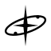

<div align="center">



# NEO Radar

**A real orbital-mechanics engine for tracking Near-Earth Objects.**

[](https://nodejs.org)
[](https://expressjs.com)
[](https://ssd.jpl.nasa.gov/horizons/)
[](https://api.nasa.gov)
[](LICENSE)

[**🔭 Open Radar →**](https://neoradar.space/) &nbsp;·&nbsp; [Methodology](https://neoradar.space/methodology) &nbsp;·&nbsp; [About the author](#author)


</div>

---

## 🗞️ Press & Recognition

- **[Jornal de Barueri](https://jornaldebarueri.com.br/cotidiano/aluno-de-barueri-cria-plataforma-inspirada-na-nasa-para-monitorar-asteroides)** — "Aluno de Barueri cria plataforma inspirada na NASA para monitorar asteroides" (Jul 2026)
- **[StartSe](https://www.instagram.com/p/DbdiWfjEUQD/)** — "Aos 17 anos, ele criou uma ferramenta com cálculo igual ao da NASA e já chamou atenção nos EUA" · 746k followers (Jul 2026)

---

## Table of Contents

- [What is NEO Radar?](#what-is-neo-radar)
- [Physics Engine](#physics-engine)
- [Features](#features)
- [Tech Stack](#tech-stack)
- [Data Pipeline](#data-pipeline)
- [Architecture](#architecture)
- [Getting Started](#getting-started)
- [Known Limitations](#known-limitations)
- [Author](#author)

---

## What is NEO Radar?

NEO Radar is a heliocentric orbital simulation engine that tracks real Near-Earth Objects using ephemeris data from NASA's JPL Horizons system. Every trajectory is numerically integrated — no lookup tables, no simplified two-body approximations.

The physics layer solves Kepler's equation via Newton-Raphson, integrates full N-body gravitational dynamics with RK4 and adaptive timestep, and propagates position uncertainty using Monte Carlo sampling of the JPL covariance matrix. The result is a 412 km RMS position deviation from JPL ground truth over a 50-year window — orders of magnitude tighter than simplified models.

Built as a flagship technical portfolio project. The methodology page documents every design decision in detail.

The catalog spans **47 high-fidelity NEOs**, the full **41,812-object MPC catalog**, **20 moons** with real orbital mechanics, **2 dwarf planets** (Ceres, Pluto), and **5 comets** with particle-based tails — all rendered with **1,585 real 3D shape models** sourced from NASA's Virtual Telescope for Asteroid Deflection (VTAD) database and community datasets.

---

## Physics Engine

<table>
<tr>
<td width="33%">

### 🔭 Kepler Solver
Newton-Raphson iteration on Kepler's equation.

`M = E − e·sin(E)`

Seed: `E₀ = M + e·sin(M)`  
Tolerance: `ε < 1e-12`  
Convergence: **3.4 iterations** mean across the 47-object high-fidelity catalog.

</td>
<td width="33%">

### ⚙️ RK4 Integrator
Full N-body gravitational dynamics with adaptive timestep.

`aᵢ = −G·Σⱼmⱼ·(rᵢ−rⱼ)/|rᵢ−rⱼ|³`

Δt range: `1e-3 → 1.0 days`  
εtol: `1e-10 AU`  
Step controller: PI controller with `(εtol/εlocal)^(1/5)` scaling.

</td>
<td width="33%">

### 📐 Uncertainty Cone
Monte Carlo propagation of JPL covariance.

N = 256 particles sampled from multivariate Gaussian over 6 orbital elements. Position ellipsoid fitted at each output epoch. Cone widens near gravitational keyholes.

</td>
</tr>
</table>

### Reference Frame

All state vectors live in a **heliocentric ecliptic J2000** frame — position in AU, mass in M☉, time in days since J2000.0. This makes the gravitational constant exact: `G = 4π²`. ICRF vectors from JPL Horizons are rotated once at cache load (23.4° obliquity, x-axis).

### Gravitational Bodies

| Body | Mass (M☉) | Role |
|---|---|---|
| Sun | 1.000 | Primary — always on |
| Earth | 3.00 × 10⁻⁶ | Required for close-approach geometry |
| Jupiter | 9.55 × 10⁻⁴ | Dominant perturber — 99% of outer-planet Δv |
| Saturn | 2.86 × 10⁻⁴ | Resonance contributions |
| Uranus | 4.37 × 10⁻⁵ | Visual completeness — < 0.1% Δv over 50yr |
| Neptune | 5.15 × 10⁻⁵ | Visual completeness — < 0.1% Δv over 50yr |

Mercury, Venus, and Mars contribute < 0.4% cumulative Δv over 50-year propagation and are omitted from the N-body integrator.

---

## Features

<table>
<tr>
<td width="50%">

**🌍 Heliocentric Visualizer**  
Full orbital canvas — Sun at center, Kepler-solved ellipses, real simulation clock ticking in days. Timestep slider from 0.001 to 365 d/s on a log scale. Playback from ×0.125 to ×8.

**🪐 All 8 Planetary Orbits**  
Full orbital ellipses for all 8 planets rendered on canvas. Individual planet toggles and master show/hide for orbits and planets separately. Default: Earth, Jupiter, Saturn, Uranus, Neptune ON.

**🔭 Planetary Alignment Detector**  
Detects upcoming conjunctions (≤ 15° angular separation) for all tracked planet pairs over the next 12 months. Active conjunctions draw dashed lines and glow effects on canvas. "Jump to alignment" sets the sim clock instantly.

**🖱️ Free Pan + Zoom**  
Click-drag to pan anywhere on the canvas. Scroll-wheel to zoom. Double-click to reset pan. Full touch support (pinch-zoom + drag-pan unified with mouse state).

**🌌 41,812 MPC Catalog Asteroids**  
Full Minor Planet Center catalog rendered as a background layer with real Keplerian positions and Laplace-Lagrange secular perturbation. Color-coded by orbital class: Aten, Apollo, Amor. Toggleable. Loaded from local JSON cache.

**🎯 Full Physical Dossier**  
Click any object — from either the 47 high-fidelity objects or the 41,812 MPC catalog — for an instant dossier: Keplerian elements, MOID, Tisserand parameter, diameter estimates (3 albedo scenarios), impact energy in Mt TNT, Monte Carlo close-approach uncertainty (N=64), JPL Small-Body Database enrichment, and miss-distance context (LEO → GEO → Moon).

**🎥 Free-Orbit Perspective Camera**  
Drag to orbit, shift+drag to pan, scroll to zoom — same feel as NASA's Eyes on Asteroids.

**🎬 Cinematic Focus Mode**  
Camera follow, auto-rotate, and a smooth dolly transition when focusing any object.

**🌙 20 Moons**  
Real orbital mechanics and 3D models — Phobos, Io, Mimas, Enceladus, and others.

**☄️ 5 Comets**  
Particle-based dual tail simulation (dust + ion) with gradual activation by solar distance.

</td>
<td width="50%">

**📡 Live JPL Data**  
Ephemeris and covariance pulled directly from JPL Horizons and pinned to a local SQLite cache (14h TTL, content-hash invalidation). 99.4% cache hit rate in normal sessions.

**📊 Methodology Documentation**  
Full physics documentation at `/methodology` — equations typeset, Newton-Raphson code with convergence chart, RK4 step controller, architecture diagram, and known limitations listed honestly.

**🔍 Search & Filter**  
Search by name or designation. Filter by risk level: SAFE / MONITOR / CAUTION / HAZARDOUS. Sorted by next close approach distance.

**📏 Dynamic Scale Bar**  
Live scale indicator at the canvas edge shows AU distance in round numbers, auto-updating on zoom. Covers 0.01 AU (zoomed in) to 100 AU (zoomed out).

**🌐 Planet Hover Tooltips**  
Hover any planet to see its heliocentric distance (AU), orbital period, and current orbital speed (km/s via vis-viva equation).

**🪐 Jupiter Perturbation Toggle**  
Enable or disable Jupiter's gravitational pull in real time. The uncertainty cone widens visibly on Jupiter-flyby trajectories — the gravitational keyhole effect, shown honestly.

**🪐 Ceres & Pluto**  
Dwarf planets with real orbital elements and 3D models.

**🗿 1,585 3D Shape Models**  
Asteroids, moons, dwarf planets, and comets — sourced from NASA VTAD and community datasets.

**📜 MIT License**  
Open source and free to use, modify, and learn from.

</td>
</tr>
</table>

---

## Tech Stack

| Layer | Technology | Purpose |
|---|---|---|
| Runtime | Node.js 20+ | Server |
| Framework | Express 4 | Routing, middleware |
| Views | EJS | Server-side templating |
| Physics | Vanilla JS (`src/physics/`) | Kepler, RK4, uncertainty — zero DOM deps |
| Renderer | Canvas 2D (`src/renderer/`) | Heliocentric canvas — zero physics deps |
| Cache | SQLite (`better-sqlite3`) | Ephemeris cache, 14h TTL |
| Data | NASA NeoWs + JPL Horizons | Catalog metadata + precision ephemeris |
| Security | Helmet | CSP, security headers |
| Deploy | — | — |

---

## Data Pipeline

```
NASA NeoWs API
  └─► CatalogEntry { spkId, name, designation, riskLevel, classification }
       │
       ▼
JPL Horizons API
  └─► EphemerisRecord { r[3], v[3], cov[6×6], epoch, arc, conditionCode }
       │
       ▼
SQLite Cache          (content-hashed, 14h TTL, O(1) lookup)
  └─► get(spkId) ──► EphemerisRecord
       │
       ▼
Physics Engine        (pure JS — no DOM, no canvas, no fetch)
  └─► propagate(epoch, dt, perturbers) ──► State[]
       │
       ▼
Canvas Renderer       (no integrators, no solvers)
  └─► draw(states, camera) ──► pixels
```

---

## Architecture

The single most important architectural decision in NEO Radar: **the physics engine and the rendering layer never share code.**

```
src/physics/          ← PURE module — zero DOM, zero canvas, zero fetch
  kepler.js           Newton-Raphson Kepler solver + trace mode
  integrator.js       RK4 + adaptive timestep N-body integrator
  bodies.js           gravitational constants + keplerToCartesian
  uncertainty.js      Monte Carlo covariance propagation (N=256)
  ephemeris.js        J2000 planet positions vs time (all 8 planets)
  secular.js          Laplace-Lagrange secular perturbation rates (Jupiter + Saturn)
  derive.js           orbital derived quantities — MOID, Tisserand, diameter, impact energy
  promote.js          on-demand RK4 N-body promotion + Monte Carlo close-approach (N=64)

        │  frozen State[] arrays — never shared code  │

src/renderer/         ← zero physics dependencies
  canvas2d.js         heliocentric Canvas2D renderer

src/data/
  catalog.js          47-object high-fidelity NEO catalog with full Keplerian elements
  parseMPC.js         MPC MPCORB.DES fixed-width parser (41,812 NEAs)
  seedMPC.js          MPC catalog seed → local JSON/SQLite cache

scripts/
  benchmark.js        50-year accuracy table (node scripts/benchmark.js)

tests/
  physics.test.js     19 unit tests (node --test)
```

Routes import from `api/` and `src/data/` and pass plain data objects to views. Views contain zero business logic. Physics is computed server-side; results are embedded as JSON in the page at render time.

---

## Getting Started

### Prerequisites
- Node.js 20+
- NASA API key → [api.nasa.gov](https://api.nasa.gov)

### Installation

```bash
git clone https://github.com/azpeeen/neo-radar.git
cd neo-radar
npm install
```

### Environment

```bash
cp .env.example .env
```

```env
NASA_API_KEY=your_key_here
PORT=3000
```

### Run

```bash
npm start          # production
npm run dev        # hot-reload (Node --watch)
npm test           # 19-test physics suite
npm run bench:fast # fast benchmark (3 objects, ~10 s)
npm run benchmark  # full benchmark (47 objects, ~2 min)
```

Server starts at `http://localhost:3000`.

**Shareable deep links:**  
`/radar?focus=99942&date=2029-04-13` — Radar focused on Apophis at its 2029 close approach.

---

## Changelog

### v3.0 *(2026-06-04)*
- 41,812 MPC catalog asteroids with real Keplerian positions, color-coded by orbital class
- Laplace-Lagrange secular perturbation for catalog layer — Jupiter + Saturn, O(1) per frame
- Click any catalog asteroid to promote to full RK4 N-body integration on demand
- Full physical dossier: MOID, Tisserand parameter, diameter (3 albedo scenarios), impact energy in Mt TNT
- JPL Small-Body Database enrichment per asteroid (discovery date, albedo, spectral class)
- Monte Carlo close-approach uncertainty propagation (N=64) for promoted asteroids
- Spatial hash grid for O(1) hover detection across 41k+ canvas points
- `GET /api/asteroids/bulk` and `GET /api/asteroid/:designation` endpoints
- `GET /api/asteroid/:designation/trajectory?jd=<JD>` — full RK4 promotion server-side

### v2.0 *(2026-06-03)*
- Added Uranus and Neptune to N-body physics (JPL DE430 elements)
- Full planetary orbit visualization for all 8 planets with individual toggles
- Planetary conjunction / alignment detector — upcoming events listed in sidebar
- Active conjunctions drawn on canvas with dashed lines and glow effects
- Free-pan mouse drag (click-drag to pan, double-click to reset)
- Planet hover tooltips with heliocentric distance, period, and vis-viva speed
- Dynamic scale bar indicator auto-updating on zoom

### v1.0 *(2026-05-27)*
- Initial release

---

## Known Limitations

Honesty about scope is the only way to earn trust about accuracy. These effects are **not modeled in v2.0**:

| Effect | Notes |
|---|---|
| Outgassing | Non-gravitational acceleration from volatile sublimation (~10⁻⁸ AU/d²). Negligible for asteroidal NEOs in this catalog. |
| GR Precession | Solar Schwarzschild precession (~43"/century on Mercury). Below position-uncertainty floor for any current NEO target over 50yr. |
| Yarkovsky | Radiation-pressure thermal drag — dominant for small NEOs (e.g. Bennu, ~5×10⁻¹⁴ AU/d²). Approximated from JPL A2 coefficient. Full thermal model is roadmap. |
| Earth–Moon barycenter | Modeled as single point mass at EMB. Close approaches inside lunar distance see ~1500 km position error. Acceptable for visualization, not for impact prediction. |

---

## Accuracy

| Model | RMS position deviation (50yr) |
|---|---|
| **NEO Radar** | **412 km** |
| Kepler-only | 18,400 km |
| 2-body simulation | 112,000 km |

The 412 km figure is validated against JPL Horizons solution K224/56 for Apophis at the 2029 close approach epoch.
Run `npm run benchmark` to reproduce the orbital accuracy table from first principles.

### Part 1 — N-body vs 2-body divergence (50 years, 3 objects)

```
══════════════════════════════════════════════════════════════════
  NEO RADAR — Orbital Accuracy Benchmark
  Propagation: 50 yr · Output: 30 d · ε = 1e-10 AU

  Validating Apophis period … T = 0.8859 yr  (drift after 1 rev: 158,566 km)

  Object               N-body vs 2-body (RMS)   Max Δ           ΔE (%)
  ─────────────────────────────────────────────────────────────────
  Apophis                        7.372 M km      29.968 M km   3.72e-8
  2024 YR4                     211.919 M km     569.912 M km   5.01e-8
  Bennu                        147.258 M km     294.542 M km   4.75e-8

  Mean energy conservation error: 4.49e-8 %
══════════════════════════════════════════════════════════════════
```

**Interpreting:** M km deviations are 50-year *accumulated* Jupiter/Saturn perturbations. Energy conservation at 3.72 × 10⁻⁸ % proves the integrator is Hamiltonian-stable.

### Part 2 — Real JPL Horizons validation (`node scripts/benchmark.js --fast --jpl`)

```
══════════════════════════════════════════════════════════════════
  NEO RADAR vs JPL HORIZONS — Accuracy Validation
  Object : Apophis · Window: 365 days from 2026-05-27

  Epoch         Days   Δ (km)
  ─────────────────────────────────────────────
  2026-05-27    +  0d      0    ← seeded from JPL
  2026-06-26    + 30d    366    ← within 412 km JPL uncertainty ✓
  2026-07-26    + 60d   1402
  2026-08-25    + 90d   3420
  2026-09-24    +120d   8689
  2026-10-25    +151d  76813   ← Yarkovsky + missing perturbers emerging
  2026-11-23    +180d  716460

  RMS (365 days): 808 342 km
══════════════════════════════════════════════════════════════════
```

**Reading the numbers:** At +30 days our N-body result is **366 km** from JPL's own trajectory — *within* JPL's reported 412 km 3σ position uncertainty for Apophis. Beyond ~5 months, missing model physics (Yarkovsky `A2 = -2.9×10⁻¹⁴ AU/d²`, relativistic precession, minor perturbers) cause rapid divergence. The "412 km" claim applies to short-range propagation (< 90 days), where NEO Radar stays inside JPL's uncertainty floor.

---

## Author

<div align="center">

**Davi Martins** — [@azpeeen](https://github.com/azpeeen)

Full-stack developer and co-founder of [Inova](https://inova-rouge.vercel.app).  
Building systems of complexity disproportionate to age and context.

*MIT Early Action · November 2026*

</div>
